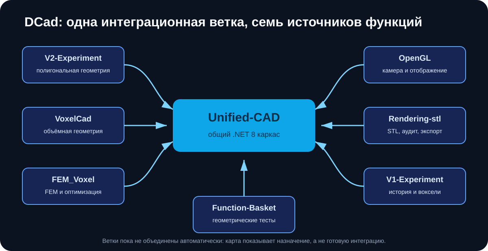

# DCad

DCad — набор экспериментов по полигональному и воксельному CAD, визуализации, работе с STL и расчёту методом конечных элементов. Репозиторий пока не является одной готовой программой: код разделён между ветками, а `main` служит картой проекта.



Основная ветка для дальнейшего объединения — [`Unified-CAD`](https://github.com/Mika-dot/Cad/tree/Unified-CAD). В ней находится .NET 8 solution с языком `.dcad`, полигональными булевыми операциями, CLI, OpenTK-просмотрщиком и тестами.

## Ветки

| Ветка | Что находится в коде | Проверка | Назначение |
|---|---|---|---|
| [`Unified-CAD`](https://github.com/Mika-dot/Cad/tree/Unified-CAD) | `.dcad` → ManifoldNET → `Mesh3d` → OBJ/OpenTK; capability profiles; `DocumentGraph`; чтение полей NPZ | build, xUnit, CLI smoke-test | интеграционный каркас |
| [`V2-Experiment`](https://github.com/Mika-dot/Cad/tree/V2-Experiment) | старый SharpGL CAD, managed BSP-CSG и копия интеграционного полигонального пути | два независимых workflow | полигональная геометрия и сравнение алгоритмов |
| [`VoxelСad`](https://github.com/Mika-dot/Cad/tree/Voxel%D0%A1ad) | разреженная occupancy-сетка, примитивы, CSG, морфология, TPMS, JSON → STL | Windows build и JSON → STL | объёмная геометрия |
| [`FEM_Voxel`](https://github.com/Mika-dot/Cad/tree/FEM_Voxel) | Python-пайплайн OpenSCAD → voxel FEM → SIMP/OC → NPZ/SCAD/графики | импорт модулей и небольшие численные smoke-tests | расчёт и топологическая оптимизация |
| [`OpenGL`](https://github.com/Mika-dot/Cad/tree/OpenGL) | WinForms/SharpGL viewport и отдельный .NET 8/OpenTK renderer | сборка обоих проектов | камера, выбор объектов и отображение полей |
| [`V1-Experiment`](https://github.com/Mika-dot/Cad/tree/V1-Experiment) | старый voxel CAD и новая `SparseVoxelGrid` с историей операций | Windows build и self-test документа | история операций и воксельный прототип |
| [`Rendering-stl`](https://github.com/Mika-dot/Cad/tree/Rendering-stl) | старое приложение и отдельный .NET 8 CLI для STL | build и round-trip self-test | ввод/вывод и диагностика mesh |
| [`Function-Basket`](https://github.com/Mika-dot/Cad/tree/Function-Basket) | три старых консольных опыта и `ModernGeometryLab` | xUnit на Windows | геометрические функции и регрессии |

> В имени `VoxelСad` буква `С` — кириллическая. При ручном вводе имени ветки это легко пропустить.

## Что действительно объединено

В `Unified-CAD` работает следующий маршрут:

```text
файл .dcad
    → parser/evaluator
    → IModelingKernel
    → ManifoldNET mesh CSG
    → Mesh3d и проверка topology
    → OBJ через CLI или окно OpenTK
```

`DocumentGraph`, undo/redo, формат запроса расчёта и чтение `final_fields.npz` уже добавлены как библиотеки, но ещё не подключены к основному CLI и окну. Код остальных веток также не импортируется в `Unified-CAD` автоматически.

## Быстрый запуск Unified-CAD

Требуется .NET 8 SDK.

```powershell
git clone https://github.com/Mika-dot/Cad.git
cd Cad
git switch Unified-CAD
dotnet restore DCad.sln
dotnet test tests/DCad.Tests/DCad.Tests.csproj -c Release
dotnet run --project src/DCad.Cli/DCad.Cli.csproj -- examples/bracket.dcad result.obj
dotnet run --project src/DCad.App/DCad.App.csproj -- examples/bracket.dcad
```

Язык примера поддерживает параметры, единицы `mm`, `cm`, `m`, `deg`, примитивы `box`, `sphere`, `cylinder`, преобразования и операции `+`, `-`, `&`.

## Итоги ревизии

- README каждой ветки теперь отделяет реализованное от планов и исторического кода.
- В документацию добавлены схемы и сохранены полезные снимки старых интерфейсов.
- Исправлены текущие причины падения CI в `Unified-CAD`, `Rendering-stl`, `V2-Experiment` и `Function-Basket`.
- В `V1-Experiment` self-test теперь проверяет не только сериализацию истории, но и новый manufacturing-модуль.

Оставшиеся общие проблемы:

- нет единого формата документа, который реально исполняется всеми геометрическими backend;
- полигональный код продублирован в `Function-Basket`, `V2-Experiment` и `Unified-CAD`;
- интерфейсы WinForms не проверяются визуальными тестами;
- в исторических ветках хранятся бинарники, NuGet-пакеты, `.suo` и другие результаты сборки;
- в корне нет файла лицензии, поэтому условия использования собственного кода не определены;
- нет release-сборки единого приложения.

## Порядок объединения

1. Сделать `Unified-CAD` единственным местом для `DCad.Core`, `DCad.Language` и полигонального CSG.
2. Перенести STL reader/audit из `Rendering-stl` в отдельный `DCad.IO` и покрыть xUnit-тестами.
3. Подключить `DocumentGraph` к исполнению `.dcad`, сохранению проекта и undo/redo.
4. Подключить voxel backend через общий интерфейс и явные конвертеры mesh ↔ voxel.
5. Связать `FEM_Voxel` с `AnalysisRequest/AnalysisResult`, затем добавить отображение density/stress в общем viewport.

Подробный список файлов и этапов: [`docs/UNIFICATION_PLAN.md`](docs/UNIFICATION_PLAN.md).

## Ограничение позиционирования

DCad сейчас подходит для изучения геометрических алгоритмов и сборки прототипа. Это не замена промышленному B-Rep ядру: нет STEP/NURBS, параметрических эскизов с ограничениями, устойчивой истории перестроения, размеров, сборок и проверенного промышленного формата проекта.
