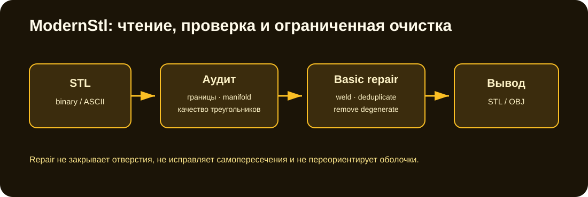

# Rendering-stl / ModernStl

[](https://github.com/Mika-dot/Cad/actions/workflows/stl-toolkit-ci.yml)

Ветка объединяет историческое WinForms-приложение со станочными моделями и отдельный .NET 8 CLI `ModernStl`. Для новых задач следует использовать `ModernStl`; каталоги `Rendering stl`, `bunker hydrodynamics`, `body` и `media` сохранены как исходные материалы старого проекта.



## Возможности ModernStl

- автоматическое распознавание binary/ASCII STL;
- запись binary/ASCII STL;
- экспорт OBJ;
- площадь поверхности, signed-volume по треугольникам и bounds;
- подсчёт degenerate и duplicate triangles;
- boundary и non-manifold edges;
- количество welded vertices, connected components и isolated triangles;
- диагностика несогласованных направлений рёбер;
- библиотечная оценка aspect ratio, minimum angle и boundary loops/open chains;
- базовая очистка: weld, удаление degenerate и duplicate triangles;
- масштабирование модели;
- встроенный round-trip self-test на замкнутом кубе.

## Сборка

Требуется .NET 8 SDK.

```bash
dotnet build ModernStl/DCad.StlToolkit.csproj -c Release
```

## CLI

Аудит:

```bash
dotnet run --project ModernStl/DCad.StlToolkit.csproj -- model.stl
```

Очистка и изменение допуска weld:

```bash
dotnet run --project ModernStl/DCad.StlToolkit.csproj -- \
  model.stl --repair repaired.stl --weld 0.000001
```

OBJ и ASCII STL:

```bash
dotnet run --project ModernStl/DCad.StlToolkit.csproj -- \
  model.stl --obj model.obj --ascii model-ascii.stl
```

Self-test:

```bash
dotnet run --project ModernStl/DCad.StlToolkit.csproj -- --self-test
```

Параметр `--scale N` масштабирует координаты перед анализом и экспортом.

## Что выводит аудит

```text
triangles
uniqueVertices
components
isolatedComponents
degenerate
boundaryEdges
nonManifoldEdges
inconsistentDirectedEdges
duplicateTriangles
surfaceArea
absoluteVolume
bounds
closedManifold
```

`closedManifold` в текущем коде означает только отсутствие degenerate, boundary и non-manifold edges. Несогласованный winding и duplicate triangles выводятся отдельно и не меняют этот флаг.

Метрики качества треугольников из `StlToolkit.Quality.cs` пока доступны только через API и не печатаются CLI.

## Что делает и чего не делает repair

`RepairBasic`:

1. объединяет координаты в пределах quantization tolerance;
2. удаляет треугольники ниже заданной площади;
3. удаляет повторные треугольники без учёта их winding.

Он не:

- закрывает отверстия;
- исправляет self-intersections;
- переориентирует оболочки;
- разделяет пересекающиеся компоненты;
- выполняет remesh/simplify;
- проверяет минимальную толщину детали.

## Проверка CI

GitHub Actions на Ubuntu собирает проект и запускает self-test: создаёт куб из 12 треугольников, проверяет topology/объём, записывает binary STL и читает его обратно.

В ходе ревизии исправлен stack overflow, возникавший при печати `Vec3d`: автогенерированный `record struct.ToString()` рекурсивно включал вычисляемое свойство `Normalized`.

## Ограничения форматов и чисел

- Binary/ASCII detection основан на совпадении длины файла с `84 + 50 × triangleCount`.
- STL не хранит единицы; пользователь сам задаёт смысл координат и `--scale`.
- Аудит использует quantization tolerance; неудачный допуск может как разорвать общий шов, так и слить близкие разные вершины.
- `absoluteVolume` берётся после суммирования signed volumes; противоположно ориентированные оболочки могут частично компенсироваться.
- OBJ writer не объединяет вершины и создаёт три вершины на каждый triangle.
- `StlMesh` остаётся triangle soup, не half-edge/indexed mesh.

## Следующая работа

1. Перенести reader/audit в `Unified-CAD` и использовать общий `Mesh3d`.
2. Добавить xUnit corpus из повреждённых STL: holes, flipped shells, duplicate faces, self-intersections.
3. Вывести quality/boundary diagnostics в CLI и JSON-отчёт.
4. Добавить безопасную ориентацию connected shells и явный отчёт о произведённых изменениях.
5. После этого рассматривать hole filling, BVH self-intersection и 3MF.
