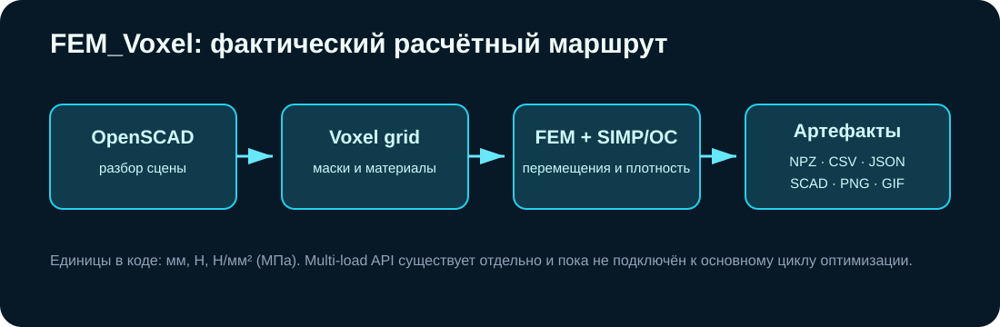

# FEM_Voxel

[](https://github.com/Mika-dot/Cad/actions/workflows/fem-voxel-ci.yml)

Python-прототип, который читает ограниченное подмножество OpenSCAD, строит регулярную воксельную расчётную область, выполняет линейный FEM и меняет плотность проектной области методом SIMP/OC.



## Что реализовано

- разбор `cube`, `sphere`, `cylinder`, `translate`, `rotate`, `union`, `difference` и простых module-вызовов;
- аннотации `GD_SCENE` и `GD_ENTITY` для нагрузок, закреплений и ролей объектов;
- регулярная сетка из восьмиузловых hexa-элементов через scikit-fem;
- sparse assembly и несколько путей решения линейной системы;
- SIMP с обновлением Optimality Criteria;
- фильтрация чувствительности/плотности и Heaviside projection;
- контроль связности итоговой бинарной маски;
- Streamlit UI и headless CLI;
- SCAD, CSV, JSON, PNG, GIF и `final_fields.npz` на выходе.

Отдельные модули содержат multi-load расчёт, robust projection triplet, KS aggregation и ограничение нависаний. Они ещё не образуют единый multi-constraint цикл оптимизации.

## Установка

Требуется Python 3.13 для совпадения с CI.

```bash
python -m venv .venv
```

Windows:

```powershell
.venv\Scripts\Activate.ps1
python -m pip install -r requirements.txt
```

Linux/macOS:

```bash
source .venv/bin/activate
python -m pip install -r requirements.txt
```

## Запуск

CLI:

```bash
python main.py --scene path/to/model.scad --output-root output
```

UI:

```bash
streamlit run ui_app.py
```

В репозитории пока нет готового `.scad` примера. Без `--scene` программа ищет `test.scad` в текущем каталоге.

## Входная модель

Надёжный режим — файл с явными `GD_ENTITY`-аннотациями. Для каждой сущности можно задать `role`, материал, `fix`, `force`, `connect`, `preserve` и `avoid`.

Обычный OpenSCAD без аннотаций поддерживается только как запасной вариант: parser находит последовательность `translate(...) cube|sphere|cylinder` и назначает первой сущности роль anchor, второй obstacle, третьей load. Для инженерного расчёта такую автоматическую интерпретацию нужно проверять вручную.

Полным интерпретатором OpenSCAD parser не является. Hull, minkowski, polyhedron, import, text, offset и произвольный код не поддерживаются.

## Единицы

| Величина | Единица |
|---|---|
| координаты, размеры, перемещения | мм |
| сила | Н |
| модуль Юнга, предел текучести, напряжение | Н/мм² = МПа |
| плотность материала | кг/мм³ |

Передача модуля Юнга в паскалях при геометрии в миллиметрах делает модель ошибочно жёсткой примерно в миллион раз.

## Результаты запуска

Каждый запуск создаёт `output/run_YYYYMMDD_HHMMSS/`:

| Файл | Содержимое |
|---|---|
| `final_connector.scad` | найденная геометрия коннектора |
| `final_scene_preview.scad` | сцена для просмотра в OpenSCAD |
| `final_fields.npz` | grid, masks, density, stress и manifest |
| `metrics.csv` | метрики итераций |
| `summary.json` | итоговые численные значения |
| `status.json` | состояние выполняющегося/завершённого запуска |
| `frames/*.png`, `animation.gif` | геометрия и напряжения по итерациям |

Описание NPZ: [`docs/DCAD_FIELD_FORMAT.md`](docs/DCAD_FIELD_FORMAT.md).

## Что проверяет CI

CI устанавливает зависимости, компилирует Python-модули и запускает два небольших теста: преобразование линейного поля в grid и функции из `advanced_optimization.py`.

CI не выполняет полный FEM/SIMP прогон, не сравнивает задачу с аналитическим решением и не проверяет Streamlit. Поэтому зелёный workflow подтверждает целостность модулей, но не точность инженерного результата.

## Ограничения

- только линейная упругость и регулярная voxel/hexa сетка;
- нет контакта, пластичности, больших деформаций, buckling и eigenfrequency;
- критерий напряжений не включён как полноценное ограничение OC/MMA;
- multi-load API не подключён к основному `optimize_connector`;
- нет верификационного набора задач с известным решением;
- разрешение напрямую влияет на память, время и ступенчатость границы;
- экспортированная геометрия требует отдельной проверки перед изготовлением;
- `final_fields.npz` читается в `Unified-CAD`, но пока не отображается там.

## Следующие задачи

1. Добавить маленькую эталонную сцену и полный CI-прогон с допустимыми численными диапазонами.
2. Подключить несколько load cases к вычислению чувствительности и обновлению плотности.
3. Добавить MMA/GCMMA для нескольких ограничений.
4. Зафиксировать версию схемы запроса/ответа с `Unified-CAD`.
5. Сравнить сеточную сходимость и результат с CalculiX/Code_Aster либо другим проверенным solver.

Дополнительные формулы и заготовки: [`docs/ADVANCED_OPTIMIZATION.md`](docs/ADVANCED_OPTIMIZATION.md).
