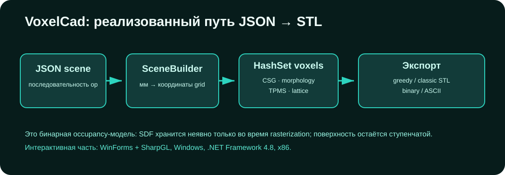

# VoxelСad

[](https://github.com/Mika-dot/Cad/actions/workflows/voxelcad-ci.yml)

Ветка DCad с дискретным объёмным представлением. Геометрия хранится как множество занятых целочисленных cells, изменяется последовательностью операций и экспортируется в STL.



> В имени ветки `VoxelСad` используется кириллическая `С`, а не латинская `C`.

## Реализованный путь

```text
JSON scene
    → SceneBuilder (мм → координаты сетки)
    → VoxelModel / HashSet<(x,y,z)>
    → CSG, implicit rasterization, morphology
    → classic или greedy STL
```

Также сохранён WinForms/SharpGL интерфейс и старый FEM-код на BriefFiniteElement.NET. Они находятся в одном проекте, но не образуют отдельный проверенный расчётный модуль.

## Возможности `VoxelModel`

| Группа | Операции |
|---|---|
| примитивы | box, sphere, Z-cylinder, torus, capsule |
| CSG | union/add, difference/subtract, intersection |
| implicit | `ApplyImplicit`, условие inside: `sdf <= 0` |
| структуры | Gyroid, Schwarz-P, BCC lattice |
| morphology | dilate, erode, open, close; 6/18/26 neighbours |
| очистка | majority smoothing, largest connected component |
| метрики | voxel count, volume, приближённая surface area, surface voxels |
| экспорт | binary/ASCII STL, classic faces или greedy rectangles |

SDF в текущем коде не хранится. Он используется только как функция для заполнения бинарной occupancy-сетки.

## Сборка

Требуются Windows, .NET Framework 4.8, NuGet и MSBuild. Проект собирается как x86.

```powershell
nuget restore OpenGL_lesson_CSharp.sln
msbuild OpenGL_lesson_CSharp.sln /m /p:Configuration=Release /p:Platform=x86 /p:RestorePackages=false
```

Интерактивный запуск:

```powershell
.\OpenGL_lesson_CSharp\bin\Release\OpenGL_lesson_CSharp.exe
```

## JSON → STL

В репозитории есть пример [`examples/modern_voxel_scene.json`](examples/modern_voxel_scene.json).

```powershell
.\OpenGL_lesson_CSharp\bin\Release\OpenGL_lesson_CSharp.exe `
  --scene .\examples\modern_voxel_scene.json `
  --out .\model.stl
```

По умолчанию пишется binary STL с greedy-объединением соседних копланарных faces.

| Опция | Результат |
|---|---|
| `--classic-stl` | binary STL без greedy merge |
| `--ascii` | ASCII STL с отдельными voxel faces |
| `--out path.stl` | явный путь результата |

Пример сцены:

```json
{
  "voxelsPerMm": 1.0,
  "operations": [
    { "op": "addBox", "x0": 0, "y0": 0, "z0": 0, "x1": 40, "y1": 30, "z1": 20 },
    { "op": "subtractSphere", "cx": 20, "cy": 15, "cz": 10, "radius": 7 },
    { "op": "addGyroid", "x0": 4, "y0": 4, "z0": 4, "x1": 36, "y1": 26, "z1": 16, "period": 8, "thickness": 1.2 },
    { "op": "close", "iterations": 1, "neighborhood": "6" },
    { "op": "keepLargest" }
  ]
}
```

Размеры JSON заданы в миллиметрах. `voxelsPerMm = 2` означает cell size 0.5 мм.

Неизвестный `op` сейчас не останавливает выполнение: `SceneBuilder` печатает `[WARN]` и пропускает операцию. Поэтому вывод CLI следует просматривать, особенно при ручном редактировании JSON.

## Что проверяет CI

GitHub Actions на Windows:

1. восстанавливает NuGet-пакеты;
2. собирает Release/x86;
3. запускает пример JSON;
4. проверяет, что создан непустой binary STL.

CI не проверяет геометрическое сходство результата, manifold topology STL, UI и старый FEM.

## Ограничения

- `HashSet` хранит отдельный объект ключа на cell и плохо масштабируется по памяти/cache locality;
- поверхность ограничена размером cell и остаётся ступенчатой даже после greedy meshing;
- нет narrow-band SDF, adaptive grid, octree/VDB и multi-material field;
- morphology создаёт большие временные множества;
- greedy meshing уменьшает triangle count, но не сглаживает поверхность;
- неизвестные JSON-операции пропускаются, а не считаются ошибкой;
- renderer использует старый SharpGL/WinForms путь;
- FEM в старом `VoxelModel.cs` не имеет отдельной верификации и не связан с `FEM_Voxel`;
- нет импорта mesh/scan и формата проекта с undo/redo.

## Следующие задачи

1. Вынести voxel storage за интерфейс и добавить chunk/brick backend.
2. Сделать строгую JSON-схему: неизвестная операция и неверный параметр должны завершать CLI с ошибкой.
3. Добавить тесты CSG/morphology и проверку объёма/STL topology.
4. Перенести backend в `Unified-CAD` и подключить `DocumentGraph`.
5. После этого вводить signed-distance field и mesh ↔ voxel conversion.

Подробный исследовательский список: [`docs/VOXEL_CAD_ROADMAP.md`](docs/VOXEL_CAD_ROADMAP.md).
