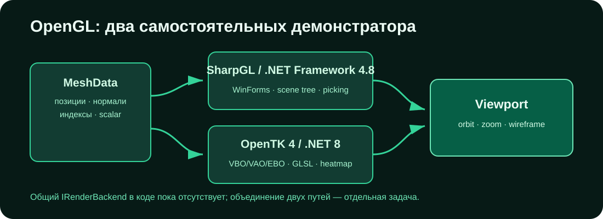

# OpenGL — визуализация DCad

[](https://github.com/Mika-dot/Cad/actions/workflows/opengl-ci.yml)
[](https://github.com/Mika-dot/Cad/actions/workflows/modern-renderer-ci.yml)

Ветка содержит два независимых демонстратора: WinForms/SharpGL на .NET Framework 4.8 и небольшой OpenTK renderer на .NET 8. Общего `IRenderBackend` между ними пока нет.



## 1. WinForms / SharpGL viewport

Каталог: `OpenGL_lesson_CSharp/`.

Реализовано:

- `Camera3D`: perspective/orthographic, orbit, pan, zoom, fit и стандартные виды;
- `Scene3D` и `SceneObject`;
- CPU ray picking;
- scene tree и `PropertyGrid`;
- grid и оси;
- режимы `Shaded`, `ShadedEdges`, `Wireframe`, `XRay`;
- подсветка выбранного объекта;
- изменение transform и цвета через инспектор.

Сборка требует Windows, Visual Studio Build Tools/MSBuild и .NET Framework 4.8:

```powershell
nuget restore OpenGL_lesson_CSharp\OpenGL_lesson_CSharp.sln
msbuild OpenGL_lesson_CSharp\OpenGL_lesson_CSharp.sln /m /p:Configuration=Release /p:Platform=x86
```

Управление:

| Действие | Ввод |
|---|---|
| выбрать объект | ЛКМ |
| orbit | ПКМ + drag или `Alt` + ЛКМ + drag |
| pan | СКМ + drag или `Shift` + ЛКМ + drag |
| zoom | колесо |
| fit | `F` |
| perspective / orthographic | `P` |
| grid / lighting / render mode | `G` / `L` / `W` |
| front, back, left, right, top, bottom, isometric | `1`…`7` |
| снять выбор | `Esc` |

Архивный снимок ранней версии интерфейса:


## 2. ModernRenderer

Каталог: `ModernRenderer/`.

Это OpenTK 4.9.4 / OpenGL 3.3 Core пример с VAO/VBO/EBO, GLSL, indexed triangles, нормалями и scalar heatmap.

```bash
dotnet run --project ModernRenderer/DCad.Renderer.csproj
```

Управление:

| Действие | Ввод |
|---|---|
| orbit | ЛКМ + drag |
| zoom | колесо |
| wireframe | `W` |
| heatmap | `H` |
| сброс вида | `F` |
| выход | `Esc` |

`ViewportMath.cs` содержит расчёт screen ray, ray/triangle picking и линейное/log/symmetric нормирование scalar field. Эти функции компилируются вместе с renderer, но отдельными unit-тестами пока не покрыты.

## Что проверяет CI

- Windows workflow восстанавливает NuGet и собирает SharpGL-проект в Release/x86.
- Ubuntu workflow собирает `ModernRenderer` на .NET 8.

CI не создаёт OpenGL context, не открывает окно и не сравнивает кадры. Зелёная сборка не проверяет работу драйвера и визуальный результат.

## Ограничения

- демонстраторы используют разные типы mesh и камеры;
- нет загрузки общей сцены DCad;
- нет GPU object/face ID picking;
- отсутствуют clipping planes, gizmo, измерения и snapping;
- нет тестов матриц камеры и выбора объектов;
- legacy-путь привязан к Windows/x86/SharpGL;
- ModernRenderer отображает только встроенную demo mesh.

## Следующая работа

1. Перенести общий `MeshData` и интерфейс камеры в `Unified-CAD`.
2. Добавить unit-тесты для `ViewportMath` без запуска окна.
3. Загружать `Mesh3d` и scalar fields из единого документа.
4. Реализовать object/face ID framebuffer и рамку выбора.
5. После переноса оставить в этой ветке только исторические сравнения renderer.
