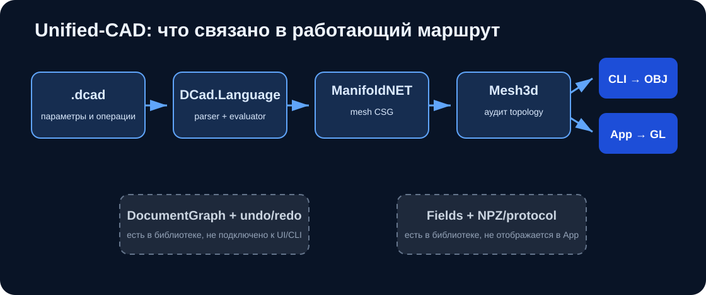

# DCad — Unified-CAD

[](https://github.com/Mika-dot/Cad/actions/workflows/unified-cad-ci.yml)

`Unified-CAD` — интеграционная ветка репозитория. Здесь собран исполняемый маршрут от текстовой модели до проверенной треугольной сетки, OBJ и окна OpenGL.



## Состояние

Работает:

- .NET 8 solution;
- параметры и операции в файлах `.dcad`;
- `box`, `sphere`, `cylinder`;
- `translate`, `rotate`, `scale`;
- `union`, `difference`, `intersection`;
- адаптер ManifoldNET для булевых операций над mesh;
- явное описание representation/capabilities геометрического backend;
- индексированная `Mesh3d` и проверка topology;
- экспорт OBJ из CLI;
- OpenTK 4 viewer;
- xUnit-тесты геометрии, языка и истории документа;
- чтение формата `final_fields.npz`, создаваемого веткой `FEM_Voxel`;
- JSON-схема запроса и краткого результата расчёта.

Пока не связано в одно приложение:

- `.dcad` исполняется напрямую и не создаёт `DocumentGraph`;
- undo/redo существует только как библиотечный класс;
- `DCad.Fields` не подключён к CLI и viewer;
- окно показывает одну итоговую сетку без дерева объектов, выбора граней и редактирования параметров;
- сохранение проекта отсутствует.

## Структура solution

| Проект | Содержимое |
|---|---|
| `DCad.Core` | векторы, допуски, `Mesh3d`, triangulation, point-in-solid, `DocumentGraph` |
| `DCad.Boolean.Manifold` | реализация `ICapabilityModelingKernel` поверх ManifoldNET |
| `DCad.Language` | lexer/parser/evaluator языка `.dcad` |
| `DCad.Cli` | выполнение файла и запись OBJ |
| `DCad.App` | OpenTK/OpenGL 3.3 viewer |
| `DCad.Fields` | structured grid, NPZ reader, analysis request/result |
| `DCad.Tests` | xUnit-регрессии |

## Язык `.dcad`

Пример из [`examples/bracket.dcad`](examples/bracket.dcad):

```text
param width = 60mm;
param depth = 40mm;
param height = 8mm;

let base = box(width, depth, height);
let hole = cylinder(20mm, 5mm);
let h1 = translate(hole, -20mm, -10mm, 0mm);
let h2 = translate(hole,  20mm, -10mm, 0mm);

solid result = base - h1 - h2;
```

Поддерживаются:

| Конструкция | Значение |
|---|---|
| `param name = expr;` | числовой параметр |
| `let name = solid;` | промежуточное тело |
| `solid result = solid;` | итоговое тело |
| `mm`, `cm`, `m`, `deg` | единицы длины и угла |
| `+`, `-`, `&` | union, difference, intersection |

Это язык последовательного построения solid. Эскизов, ограничений, циклов, массивов, именованных граней и пользовательских функций в нём нет.

## Сборка и проверка

```powershell
dotnet restore DCad.sln
dotnet build DCad.sln -c Release --no-restore
dotnet test tests/DCad.Tests/DCad.Tests.csproj -c Release --no-build
```

CLI:

```powershell
dotnet run --project src/DCad.Cli/DCad.Cli.csproj -c Release -- examples/bracket.dcad result.obj
```

Viewer:

```powershell
dotnet run --project src/DCad.App/DCad.App.csproj -c Release -- examples/bracket.dcad
```

Управление viewer:

| Клавиша | Действие |
|---|---|
| стрелки | вращение |
| `PageUp` / `PageDown` | масштаб |
| `F1` | solid / wireframe |
| `Esc` | выход |

## Проверяемые инварианты

Тесты проверяют:

- `n - 2` треугольника после triangulation простого многоугольника;
- отказ на самопересекающемся контуре;
- ожидаемые объёмы для union/intersection/difference двух коробок;
- отсутствие boundary и non-manifold edges у результатов этих операций;
- воспроизводимую классификацию точки через solid angle;
- выполнение `.dcad` с единицами;
- топологический порядок `DocumentGraph`;
- undo/redo и каскадное удаление зависимых узлов.

Это небольшой набор регрессий, а не доказательство устойчивости на произвольной CAD-геометрии.

## Зависимости и ограничения

- ManifoldNET `1.0.7-alpha` — внешняя alpha-зависимость и текущая реализация mesh CSG.
- Ветка проверяется GitHub Actions на Windows; GUI-теста и снимка кадра в CI нет.
- `Mesh3d` — треугольная сетка, не B-Rep. STEP, NURBS и точные сопряжения не поддерживаются.
- Point-in-solid выполняет полный обход треугольников; BVH отсутствует.
- NPZ reader поддерживает только ожидаемое подмножество NPY dtype/order.
- У репозитория нет общей лицензии.

## Ближайшая работа

1. Связать AST `.dcad` с `DocumentGraph`, чтобы параметры и зависимости сохранялись.
2. Добавить формат проекта и миграции его версии.
3. Подключить `DcadFieldArchive` к viewer и вывести density/stress.
4. Перенести STL I/O из `Rendering-stl` без дублирования `Mesh3d`.
5. Добавить выбор объектов/граней, дерево документа и редактирование параметров.
6. Ввести BVH для picking и spatial queries.
