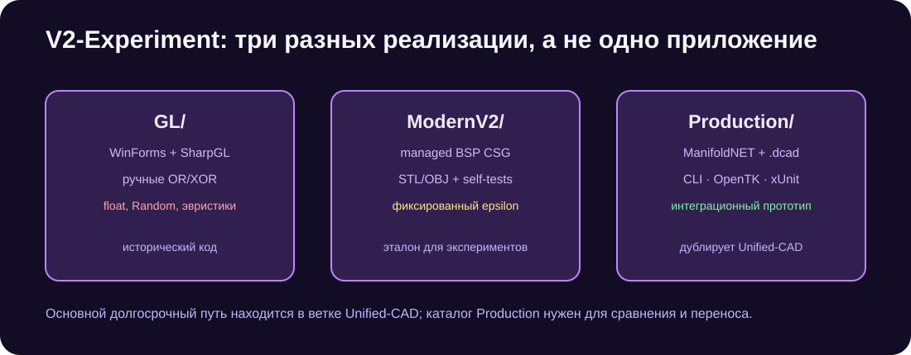
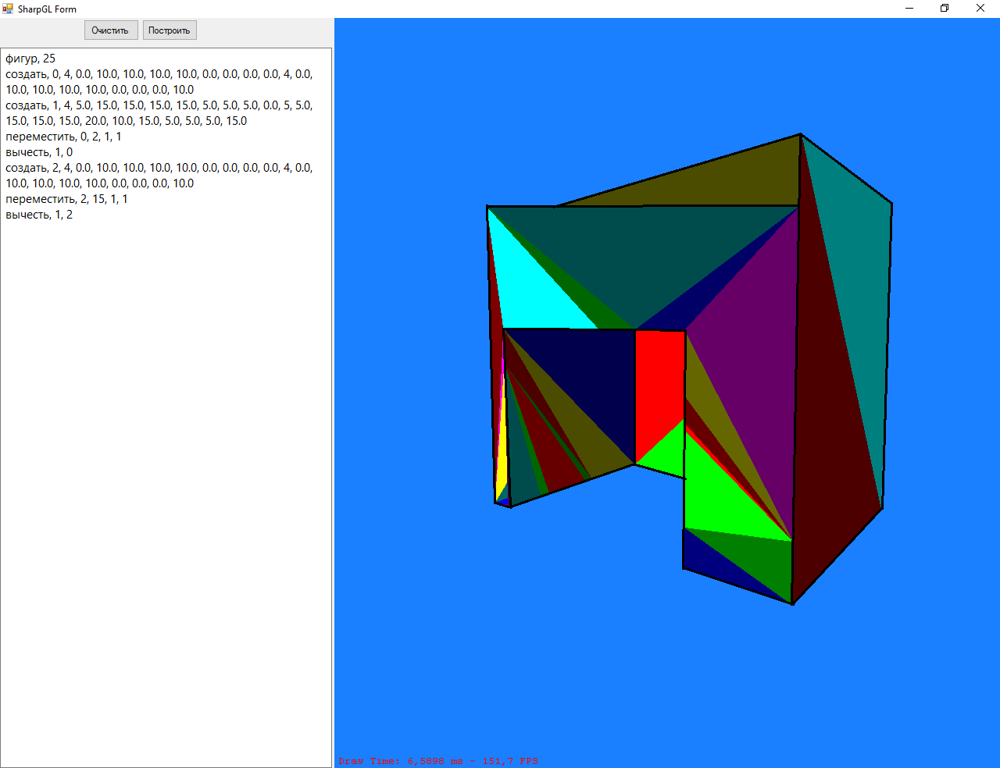

# V2-Experiment

[](https://github.com/Mika-dot/Cad/actions/workflows/v2-modern-ci.yml)
[](https://github.com/Mika-dot/Cad/actions/workflows/v2-production-ci.yml)

Полигональная линия DCad. Внутри находятся три самостоятельные реализации, поэтому ветку нельзя собирать и описывать как одну программу.



## Состав ветки

| Каталог | Технология | Статус |
|---|---|---|
| `GL/` | .NET Framework, WinForms, SharpGL, `VARcad` | исторический интерфейс и первые OR/XOR алгоритмы |
| `ModernV2/` | .NET 8, managed BSP CSG | компактная реализация для чтения и экспериментов |
| `ModernV2/Production/` | .NET 8, ManifoldNET, OpenTK, xUnit | интеграционный прототип, почти полностью дублирующий ранний `Unified-CAD` |

Для дальнейшей разработки приложения следует использовать ветку [`Unified-CAD`](https://github.com/Mika-dot/Cad/tree/Unified-CAD). Эта ветка нужна для сравнения алгоритмов и сохранения истории V2.

## Исторический GL

В `GL/OpenGL_lesson_CSharp/VARcad/VARcad.cs` реализованы ручные операции над треугольниками, классификация точки и перестроение mesh. Вычисления используют `float`, множество локальных epsilon и случайный луч в `Triangle.IsInside(...)`. Такие свойства делают результат зависимым от масштаба и запуска на сложных касаниях.

Снимок XOR из старого интерфейса:



Этот код не исправлялся в ходе ревизии: его ценность — воспроизводить старые случаи для regression tests.

## Managed BSP: ModernV2

Реализовано:

- `double`-векторы и polygon/plane BSP;
- box, cylinder, sphere;
- union, subtract, intersect;
- translate, rotate, scale;
- площадь, signed volume и bounds;
- mesh audit по boundary/non-manifold edges;
- ray picking;
- binary/ASCII STL и OBJ;
- CLI и встроенный self-test.

Сборка и запуск:

```bash
dotnet build ModernV2/DCad.MeshKernel.csproj -c Release
dotnet run --project ModernV2/DCad.MeshKernel.csproj -c Release -- --self-test
dotnet run --project ModernV2/DCad.MeshKernel.csproj -c Release -- result.stl --obj
```

Подробнее: [`ModernV2/README.md`](ModernV2/README.md).

## Интеграционный каталог Production

Содержит `DCad.Core`, адаптер ManifoldNET, язык `.dcad`, CLI, OpenTK viewer и xUnit. Это снимок полигонального пути, который затем был вынесен в отдельную ветку `Unified-CAD`.

```powershell
cd ModernV2\Production
dotnet restore DCad.sln
dotnet test tests\DCad.Tests\DCad.Tests.csproj -c Release
dotnet run --project src\DCad.Cli\DCad.Cli.csproj -- examples\bracket.dcad result.obj
```

Подробнее: [`ModernV2/Production/README.md`](ModernV2/Production/README.md).

## Исправления ревизии

- `ModernV2/DCad.MeshKernel.csproj` больше не захватывает `Production/**/*.cs` через стандартный SDK glob.
- У `Vec3d` задан явный `ToString()`, чтобы вычисляемое свойство `Normalized` не вызывало рекурсию при печати bounds.

## Ограничения

- managed BSP использует фиксированный `CsgPlane.Epsilon = 1e-7`;
- polygon soup не хранит явную half-edge topology;
- нет coplanar merge, BVH и self-intersection repair;
- self-test состоит из нескольких встроенных случаев, а не большого корпуса моделей;
- каталог `Production` зависит от alpha-пакета ManifoldNET;
- две современные реализации имеют разные mesh types и не обмениваются объектами;
- полигональный код дублируется с `Function-Basket` и `Unified-CAD`.

## Что переносить дальше

Новые исправления общего ядра следует делать в `Unified-CAD`. Из V2 нужно перенести только минимальные regression cases, на которых старый GL или managed BSP дают неверный результат.
