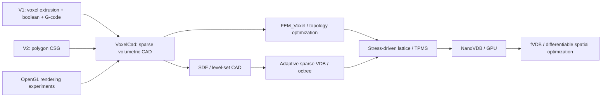

# DCad — experimental CAD & voxel engineering playground

DCad — исследовательский репозиторий с несколькими поколениями собственных CAD-подходов: от первого voxel solid modeller и polygon CSG до voxel-FEM, topology optimization и field-based geometry.

Репозиторий исторически рос через отдельные ветки. `main` теперь служит картой проекта: здесь видно, **что находится в каждой ветке, чем методы отличаются и куда развивается проект**.

## Главное направление сейчас — VoxelCAD

**[`VoxelСad`](https://github.com/Mika-dot/Cad/tree/Voxel%D0%A1ad)** — современная ветка voxel/field CAD.

В обновлении 2026 исходный box-only voxel prototype расширен до более общего geometry kernel:

- sparse occupancy grid;
- CSG union / difference / intersection;
- generic implicit/SDF rasterization API;
- box, sphere, cylinder, torus, arbitrary-axis capsule;
- Gyroid и Schwarz-P TPMS;
- BCC lattice;
- dilation / erosion / opening / closing / majority smoothing;
- connected-component cleanup;
- volume / surface metrics;
- greedy STL meshing;
- JSON scene DSL;
- headless JSON → STL CLI;
- FEM bridge с согласованными N/mm² единицами;
- Windows build + pipeline smoke CI.

Подробности, команды и полный список операций находятся в README ветки [`VoxelСad`](https://github.com/Mika-dot/Cad/tree/Voxel%D0%A1ad). Там же добавлен roadmap от текущего `HashSet`-ядра к sparse bricks → SDF/level sets → adaptive octree/VDB → Dual Contouring → NanoVDB/fVDB/GPU.

## Карта веток

| Ветка | Представление / задача | Состояние |
|---|---|---|
| **[`VoxelСad`](https://github.com/Mika-dot/Cad/tree/Voxel%D0%A1ad)** | Sparse voxel CAD, implicit primitives, CSG, TPMS/lattice, morphology, STL, FEM | **Основная voxel research ветка** |
| **[`FEM_Voxel`](https://github.com/Mika-dot/Cad/tree/FEM_Voxel)** | Voxel FEM + density-based topology optimization, SIMP + OC, filtering/projection, OpenSCAD pipeline | **Основная optimization ветка** |
| [`V1-Experiment`](https://github.com/Mika-dot/Cad/tree/V1-Experiment) | Первый voxel CAD: polygon contour → extrusion, transforms, boolean subtraction, G-code, temperature field | Историческая база |
| [`V2-Experiment`](https://github.com/Mika-dot/Cad/tree/V2-Experiment) | Polygon/triangle CAD и boolean operations | Альтернативный эксперимент |
| [`OpenGL`](https://github.com/Mika-dot/Cad/tree/OpenGL) | SharpGL/OpenGL renderer, camera/control experiments | Rendering sandbox |
| [`Function-Basket`](https://github.com/Mika-dot/Cad/tree/Function-Basket) | Архив функций и промежуточных экспериментов | Archive |
| [`Rendering-stl`](https://github.com/Mika-dot/Cad/tree/Rendering-stl) | Исторический STL/visualization + machine-control hackathon prototype | Archive / demo |

## Эволюция идеи



Первоначальная идея проекта была простой: если хранить тело как voxels, булевы операции и физические поля становятся намного проще, чем в самописном B-Rep. Ограничение тоже очевидно — фиксированная voxel grid даёт staircase surface и быстро упирается в память.

Поэтому дальнейшая линия DCad — **не просто повышать resolution**, а переходить к field-based CAD:

1. sparse chunk/brick storage вместо одного `HashSet`;
2. narrow-band Signed Distance Field вместо только binary occupancy;
3. adaptive hierarchy (octree / VDB);
4. Marching Cubes и Dual Contouring/QEF для sub-voxel surface reconstruction;
5. material/property fields;
6. FEM/topology density → lattice/TPMS geometry;
7. GPU sparse grids через NanoVDB;
8. differentiable sparse operators через fVDB как research layer.

## Почему это отличается от обычного CAD

DCad не пытается конкурировать с промышленными B-Rep kernels в задачах точных NURBS-поверхностей, параметрических сопряжений и STEP-истории построения. Цель другая — исследовать геометрию как **объёмное поле**.

Это особенно полезно для:

- topology optimization и generative engineering;
- lattice / TPMS / porous structures;
- 3D printing и manufacturing compensation;
- mesh/scan/CT → editable solid;
- multi-material geometry;
- thermal/stress/density fields;
- robust booleans над сложной входной геометрией;
- GPU geometry processing;
- differentiable 3D optimization.

## Два направления, которые имеет смысл объединить

### `VoxelСad` — geometry kernel

Отвечает за построение, CSG, implicit functions, morphology, topology cleanup и экспорт геометрии.

### `FEM_Voxel` — optimization kernel

Ветка уже ушла от жадного удаления единичных voxels к density-based **SIMP + Optimality Criteria**, sensitivity/density filtering, projection/continuation и sparse FEM assembly.

Целевая архитектура — общий sparse field backend:

```text
CAD / scan / implicit field
          ↓
   sparse SDF / material field
          ↓
 ┌────────┴─────────┐
 │                  │
CSG / morphology   FEM / SIMP / optimization
 │                  │
 └────────┬─────────┘
          ↓
 density / stress guided lattice or TPMS
          ↓
 adaptive meshing → STL / 3MF / VDB
```

## Современные ориентиры

Проект не привязан к этим библиотекам прямо сейчас, но они определяют разумное направление архитектуры на сентябрь 2026 года:

- **OpenVDB 13** — production sparse hierarchical volumes, level sets, CSG, filtering and volume/mesh conversion. В OpenVDB 13 NanoVDB заметно расширен в сторону dynamic-topology GPU operations.
- **NanoVDB** — compact GPU-friendly VDB representation с topology dilation/merge/coarsen/refine/prune в современной ветке.
- **fVDB 0.5** — differentiable GPU sparse grids, meshing/ray tracing/sparse convolution + PyTorch. Для текущего Windows/C# приложения логичнее использовать как отдельный Linux/CUDA research backend, а не жёсткую runtime-зависимость.

Базовые публикации для архитектуры:

- Frisken et al., *Adaptively Sampled Distance Fields*, SIGGRAPH 2000 — https://doi.org/10.1145/344779.344899
- Ju et al., *Dual Contouring of Hermite Data*, SIGGRAPH 2002 — https://doi.org/10.1145/566570.566586
- Museth, *VDB: High-Resolution Sparse Volumes with Dynamic Topology*, TOG 2013 — https://doi.org/10.1145/2487228.2487235
- Kämpe et al., *High Resolution Sparse Voxel DAGs*, TOG 2013 — https://doi.org/10.1145/2461912.2462024
- Williams et al., *fVDB*, SIGGRAPH 2024 — https://doi.org/10.1145/3658226

## История

Первые версии DCad создавались как студенческий эксперимент и использовались в hackathon-проектах. В репозитории поэтому намеренно сохранены старые ветки: они показывают эволюцию от ручных массивов/экструзии и OpenGL-демо к sparse volumetric modeling и вычислительной инженерии.

Сейчас наиболее интересная часть проекта — не UI старых демонстраторов, а сама идея **CAD как редактируемого sparse volumetric field**, объединённого с расчётом и генерацией структуры.
