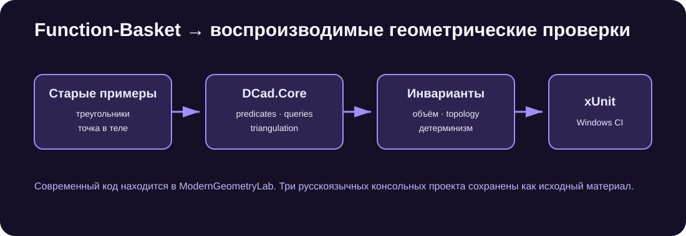

# Function-Basket / Geometry Lab

[](https://github.com/Mika-dot/Cad/actions/workflows/function-basket-geometry-lab.yml)

Ветка содержит старые консольные опыты по вычислительной геометрии и новый набор библиотек/тестов в `ModernGeometryLab`.



## Что использовать

`ModernGeometryLab/` — актуальная часть ветки:

- `DCad.Core`: векторы, допуски, AABB, треугольники, triangulation и spatial queries;
- `DCad.Boolean.Manifold`: адаптер ManifoldNET;
- `GeometryLab.Tests`: xUnit-регрессии.

Каталоги `Математика`, `точка внутри` и `пересечения двух теугольников` сохранены без модернизации. Это отдельные программы .NET 6 с ранними вариантами алгоритмов; на них не следует ссылаться как на общее ядро DCad.

## Реализованные проверки

- triangulation простого вогнутого контура с сохранением площади;
- отказ на self-intersection и нулевой длине ребра;
- детерминированная классификация точки относительно замкнутой mesh;
- тождества объёмов для union, intersection и difference;
- topology результата булевых операций;
- ray/triangle и ray/AABB;
- ближайшая точка на треугольнике;
- Morton-код для локального 3D-блока;
- `orient2d`, `orient3d` и пересечение отрезков.

`RobustPredicates` использует быстрый `double` determinant и `decimal` fallback около потери значимости. Это практическая защита для обычных инженерных координат, но не exact arithmetic и не полная реализация adaptive predicates Шевчука.

## Запуск

Требуется .NET 8 SDK.

```powershell
dotnet test ModernGeometryLab/tests/GeometryLab.Tests/GeometryLab.Tests.csproj -c Release
```

Тесты запускаются в GitHub Actions на Windows. Benchmark и fuzz/property-based тестов пока нет.

## Структура

```text
ModernGeometryLab/
├── Directory.Build.props
├── src/
│   ├── DCad.Core/
│   └── DCad.Boolean.Manifold/
└── tests/
    └── GeometryLab.Tests/
```

Подробно об актуальном наборе тестов: [`ModernGeometryLab/README.md`](ModernGeometryLab/README.md).

## Ограничения

- нет BVH, поэтому многие запросы обходят треугольники линейно;
- нет triangle/triangle с полным coplanar case;
- `Mesh3d` не half-edge и не хранит явную adjacency;
- decimal fallback имеет ограниченный диапазон и не гарантирует точный знак для всех входов;
- ManifoldNET остаётся внешней alpha-зависимостью;
- код `DCad.Core` продублирован с `V2-Experiment` и `Unified-CAD`.

## Дальнейшая роль

Новые найденные геометрические ошибки следует сначала оформлять как минимальный тест здесь, а исправление переносить в единственный `DCad.Core` ветки `Unified-CAD`. После переноса эта ветка может остаться коллекцией воспроизводимых regression cases, а не четвёртой копией ядра.
