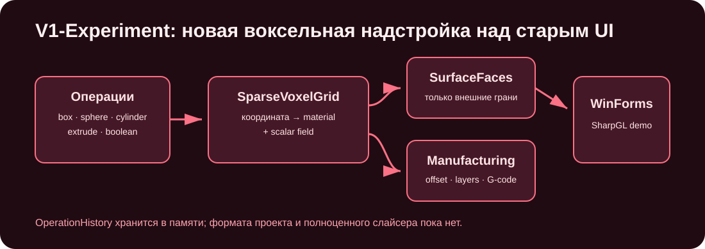
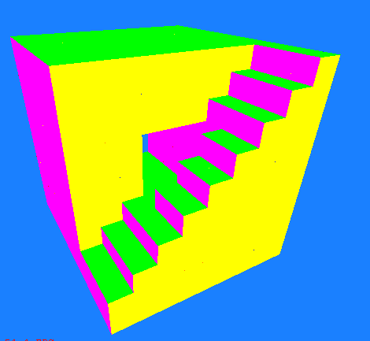
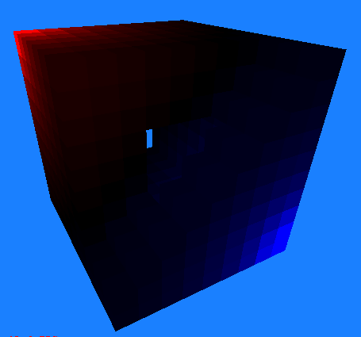
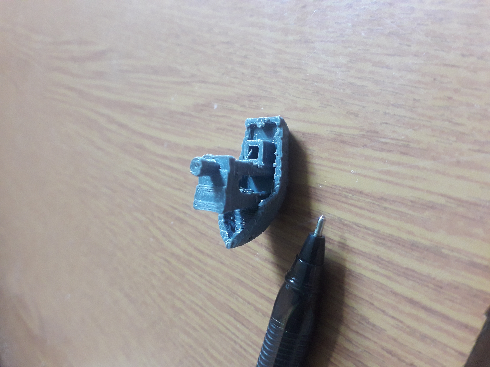

# V1-Experiment

[](https://github.com/Mika-dot/Cad/actions/workflows/v1-experiment-ci.yml)

Первая версия воксельного DCad. Ветка сохраняет исходный WinForms/SharpGL прототип и содержит новую надстройку `Modern/` с разреженной сеткой, сериализуемой историей операций и простыми инструментами подготовки траектории.



## Актуальная часть

Каталог `Cadv1.e/OpenGL_lesson_CSharp/Modern/`:

| Файл | Назначение |
|---|---|
| `VoxelEngine.cs` | `SparseVoxelGrid`, примитивы, CSG, scalar/material fields, внешние грани |
| `OperationHistory.cs` | операции, undo/redo, сохранение и загрузка `DCAD-V1|1` |
| `VoxelManufacturing.cs` | объединение соседних voxels в layer runs, оценка объёма/длины и G-code |
| `ModernVoxelDemoForm.cs` | небольшой интерактивный viewer |

## Возможности

- `Dictionary<VoxelKey, VoxelCell>` вместо синхронных массивов координат;
- box, sphere, Z-cylinder и extrusion 2D polygon;
- union, subtraction, intersection и translate;
- `Material` и одно scalar-значение на cell;
- перечисление только внешних граней через `SurfaceFaces()`;
- список операций с rebuild-based undo/redo;
- текстовый формат документа с версией;
- layer-wise serpentine и run-compressed G-code заготовки;
- demo viewer с orbit, zoom, wire overlay и heatmap.

## Сборка

Требуются Windows, .NET Framework 4.8, NuGet и MSBuild.

```powershell
nuget restore Cadv1.e\OpenGL_lesson_CSharp.sln
msbuild Cadv1.e\OpenGL_lesson_CSharp.sln /m /p:Configuration=Release /p:Platform=x86
```

Запуск новой demo-формы:

```powershell
.\Cadv1.e\OpenGL_lesson_CSharp\bin\Release\OpenGL_lesson_CSharp.exe
```

Старое окно:

```powershell
.\Cadv1.e\OpenGL_lesson_CSharp\bin\Release\OpenGL_lesson_CSharp.exe --legacy
```

Self-test без открытия окна:

```powershell
.\Cadv1.e\OpenGL_lesson_CSharp\bin\Release\OpenGL_lesson_CSharp.exe --self-test
```

Self-test проверяет AddBox, subtraction, cylinder, undo/redo, сохранение/загрузку документа, извлечение layer runs и manufacturing estimate.

## Интерфейс новой demo-формы

| Элемент | Действие |
|---|---|
| `Demo` | восстановить встроенную сцену |
| `Add sphere` | добавить сферу |
| `Cut sphere` | вычесть сферу |
| `Wire` | показать контуры граней |
| `Heat` | раскрасить scalar field |
| ЛКМ + drag | orbit |
| колесо | zoom |

Это демонстрация ядра: UI не предоставляет сохранение документа, полноценный редактор операций или экспорт.

## Исторические изображения

| Воксельная модель | Температурное поле |
|---|---|
|  |  |

В репозитории также сохранён физически напечатанный пример:



## Ограничения

- cell size логически равен одной координатной единице; отдельная grid metadata не хранится в документе;
- словарь не разбит на chunks и имеет высокий overhead на voxel;
- surface renderer рисует quads immediate-mode через SharpGL;
- polygon extrusion проверяет центр cell и не сохраняет точный контур;
- операция undo полностью перестраивает grid;
- формат `DCAD-V1|1` не хранит имя, units, настройки отображения и произвольные scalar functions;
- G-code — геометрическая заготовка без температур, ретрактов, скоростей по материалу, периметров, заполнения и machine profile;
- нет STL/3MF import/export в новом модуле;
- весь проект привязан к Windows/x86.

## Роль при объединении

Из V1 стоит перенести в `Unified-CAD` две идеи: сериализуемую историю операций и простой voxel document для тестов. Renderer и собственный формат типов переносить целиком не нужно — они дублируют ветки `OpenGL` и `VoxelСad`.
