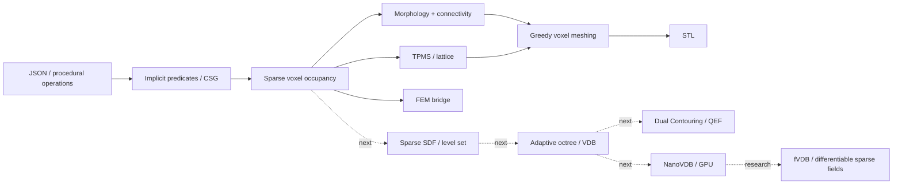

# DCad — VoxelCAD research branch

Экспериментальный CAD, в котором геометрия представлена не B-Rep/NURBS-поверхностями, а разреженным дискретным объёмом. Ветка `VoxelСad` соединяет три идеи: voxel solid modeling, implicit/SDF-подобные операции и инженерный расчёт.

> Статус: research / prototype. Это не замена Parasolid/ACIS/OpenCASCADE, а площадка для методов, где объёмное представление полезнее классического B-Rep: lattice/TPMS, топологическая оптимизация, поля материалов, сканы, аддитивное производство и geometry processing.

## Что добавлено в обновлении 2026

Старое ядро умело фактически `addBox`, `subtractBox`, экспортировать поверхность каждого вокселя в STL и строить упрощённую FEM-сетку. Теперь `VoxelModel` поддерживает:

- sparse occupancy storage на `HashSet<(x,y,z)>` без выделения плотного 3D-массива;
- CSG: union/difference/intersection для моделей и ограничивающих примитивов;
- generic implicit rasterizer `ApplyImplicit(...)` с семантикой `sdf <= 0 -> inside`;
- примитивы: box, sphere, Z-cylinder, torus, arbitrary-axis capsule;
- architected materials: Gyroid TPMS, Schwarz-P TPMS, BCC truss lattice;
- voxel morphology: dilation, erosion, opening, closing, 3×3×3 majority smoothing;
- connectivity cleanup: сохранение крупнейшей 6-связной компоненты;
- геометрические метрики: объём, приближённая площадь поверхности, выборка surface voxels;
- STL: обычный block surface и новый greedy meshing, объединяющий соседние копланарные грани;
- JSON scene DSL с новыми операциями;
- headless CLI: JSON → voxel model → STL без запуска WinForms;
- Windows CI: restore → Release/x86 build → реальный smoke-test JSON → greedy STL;
- исправлена система единиц FEM: для координат в мм сталь задаётся как `E = 210000 N/mm²`, а не `210e9 Pa`.

## Быстрый старт

Проект рассчитан на Windows, Visual Studio / MSBuild и .NET Framework 4.8.

```powershell
nuget restore OpenGL_lesson_CSharp.sln
msbuild OpenGL_lesson_CSharp.sln /p:Configuration=Release /p:Platform=x86
```

Запуск исторического интерактивного SharpGL/FEM demo:

```powershell
.\OpenGL_lesson_CSharp\bin\Release\OpenGL_lesson_CSharp.exe
```

Headless-генерация STL из JSON:

```powershell
.\OpenGL_lesson_CSharp\bin\Release\OpenGL_lesson_CSharp.exe `
  --scene examples\modern_voxel_scene.json `
  --out modern_voxel_scene.stl
```

По умолчанию используется greedy STL meshing. Для старого алгоритма добавьте `--classic-stl`, для ASCII STL — `--ascii`.

## JSON scene DSL

Минимальный пример:

```json
{
  "voxelsPerMm": 1.0,
  "operations": [
    { "op": "addBox", "x0": 0, "y0": 0, "z0": 0, "x1": 40, "y1": 30, "z1": 20 },
    { "op": "subtractSphere", "cx": 20, "cy": 15, "cz": 10, "radius": 7 },
    { "op": "addGyroid", "x0": 4, "y0": 4, "z0": 4, "x1": 36, "y1": 26, "z1": 16, "period": 8, "thickness": 1.2 },
    { "op": "close", "iterations": 1, "neighborhood": "6" },
    { "op": "keepLargest" }
  ]
}
```

Полный пример: [`examples/modern_voxel_scene.json`](examples/modern_voxel_scene.json).

### Операции

| Группа | `op` | Основные параметры |
|---|---|---|
| Box CSG | `addBox`, `subtractBox`, `intersectBox` | `x0..z1` |
| Sphere CSG | `addSphere`, `subtractSphere`, `intersectSphere` | `cx,cy,cz,radius` |
| Cylinder CSG | `addCylinderZ`, `subtractCylinderZ`, `intersectCylinderZ` | `cx,cy,z0,z1,radius` |
| Torus | `addTorusZ`, `subtractTorusZ` | `cx,cy,cz,majorRadius,minorRadius` |
| Capsule / strut | `addCapsule`, `subtractCapsule` | `a*`, `b*`, `radius` |
| TPMS | `addGyroid`, `subtractGyroid`, `addSchwarzP`, `subtractSchwarzP` | bounds, `period`, `thickness` |
| Lattice | `addBccLattice` | bounds, `cell`, `strut` |
| Morphology | `dilate`, `erode`, `open`, `close` | `iterations`, `neighborhood` = 6/18/26 |
| Cleanup | `smooth`, `keepLargest` | `iterations`, `threshold` |

Все геометрические размеры в JSON задаются в миллиметрах. `voxelsPerMm` задаёт дискретизацию. Например, `2.0` означает ребро вокселя 0.5 мм.

## Программный API

Implicit/SDF-подобный слой позволяет добавлять собственные фигуры без добавления отдельного метода в ядро:

```csharp
var vm = new VoxelModel();

vm.ApplyImplicit(
    -32, -32, -32,
     32,  32,  32,
    (x, y, z) => Math.Sqrt(x*x + y*y + z*z) - 20.0,
    VoxelBooleanMode.Union);

vm.SubtractCylinderZ(0, 0, -24, 24, 5);
vm.Close(1, VoxelNeighborhood.Faces6);
vm.KeepLargestConnectedComponent();
vm.ExportStlGreedy("part.stl", 1.0f);
```

Это пока **binary occupancy**, а не постоянно хранимое distance field: SDF используется как способ аналитически растрировать implicit geometry в воксельную сетку. Следующий архитектурный шаг — хранить узкополосное signed-distance field, чтобы получать sub-voxel поверхности и гладкие CSG/blend операции без потери информации на каждой операции.

## Почему voxel CAD вообще имеет смысл

Классический B-Rep эффективен для точных поверхностей, сопряжений и размерно-параметрического машиностроительного CAD. Voxel/field CAD выигрывает там, где объект естественно является объёмным полем:

- топологическая оптимизация и генеративный дизайн;
- lattice, porous media и TPMS;
- локально изменяемая плотность/материал;
- булевы операции над сложной и даже «грязной» геометрией;
- voxelization mesh/scan/CT data;
- erosion/dilation, offsets и manufacturing compensation;
- связка геометрии с FEM/thermal/flow полями;
- GPU processing и differentiable 3D pipelines.

Главный недостаток текущего уровня — staircase surface: точность ограничена voxel size. Поэтому современная линия развития — не «делать воксели всё мельче», а сочетать sparse hierarchy + SDF/level set + adaptive meshing.

## Архитектура



## Куда развивать дальше

Подробный технический план находится в [`docs/VOXEL_CAD_ROADMAP.md`](docs/VOXEL_CAD_ROADMAP.md). Кратко:

1. заменить одиночный `HashSet` на chunked sparse grid (например 8³/16³ bit-bricks) с Morton/Hilbert ordering;
2. ввести narrow-band SDF/level-set grid и smooth CSG/offset/fillet через поля;
3. сделать adaptive octree / VDB backend вместо фиксированного resolution;
4. заменить block/greedy meshing на Marching Cubes и Dual Contouring с QEF для sharp features;
5. перейти к multi-material voxel/field cells и локальным physical properties;
6. связать `VoxelСad` с идеями ветки `FEM_Voxel`: SIMP/OC topology optimization → field → printable lattice/TPMS;
7. вынести тяжёлое ядро в C++ (OpenVDB/NanoVDB), оставить C# как UI/automation слой либо мигрировать frontend на современный .NET;
8. GPU path: NanoVDB/CUDA/Vulkan compute; research path: fVDB + PyTorch для differentiable optimization и learned priors.

## Современная технологическая база

На сентябрь 2026 года наиболее логичные ориентиры для развития такого проекта:

- **OpenVDB 13** — иерархическое sparse volumetric storage, CSG, filtering, level sets, mesh/volume conversion. OpenVDB 13.0.0 вышел 3 ноября 2025 года; 13.0.1 находится в разработке. В 13.x NanoVDB активно расширяется от статического GPU-представления к dynamic-topology задачам, включая level-set tracking, grid building, morphology и grid merging: https://www.openvdb.org/documentation/doxygen/changes.html
- **NanoVDB** — компактное GPU-friendly представление VDB grid; в OpenVDB 13 добавлены GPU-инструменты topology dilation, merge, coarsen, refine и prune: https://www.openvdb.org/documentation/doxygen/NanoVDB_MainPage.html
- **fVDB** — GPU sparse grid framework с differentiable operators, meshing, ray tracing, sparse convolutions и PyTorch integration. Стабильная серия 0.5 вышла 1 июля 2026 года; текущие официальные бинарные сборки ориентированы на Linux + NVIDIA/CUDA, поэтому для этого Windows/C# проекта fVDB разумнее рассматривать как research sidecar, а не прямую зависимость ядра: https://github.com/openvdb/fvdb-core

## Базовые работы, на которых стоит строить дальнейшее исследование

- Frisken et al., *Adaptively Sampled Distance Fields*, SIGGRAPH 2000 — https://doi.org/10.1145/344779.344899
- Ju et al., *Dual Contouring of Hermite Data*, SIGGRAPH 2002 — https://doi.org/10.1145/566570.566586
- Museth, *VDB: High-Resolution Sparse Volumes with Dynamic Topology*, TOG 2013 — https://doi.org/10.1145/2487228.2487235
- Kämpe et al., *High Resolution Sparse Voxel DAGs*, TOG 2013 — https://doi.org/10.1145/2461912.2462024
- Williams et al., *fVDB: A Deep-Learning Framework for Sparse, Large-Scale, and High-Performance Spatial Intelligence*, SIGGRAPH 2024 — https://doi.org/10.1145/3658226

## Ограничения текущей реализации

- `HashSet` удобен для прототипирования, но заметно проигрывает brick/VDB-представлениям по cache locality и memory overhead;
- occupancy не хранит sub-voxel distance/normal/material fields;
- текущий FEM bridge — стержневая аппроксимация соседних voxel centres, а не полноценный 8-node hexahedral solid FEM;
- SharpGL immediate/display-list rendering — исторический frontend; для больших моделей нужен chunk mesh + VBO/instancing/compute-driven rendering;
- greedy STL сохраняет кубическую поверхность. Для гладкой implicit-геометрии нужен SDF mesher.

Именно поэтому ветка теперь разделяет **implemented baseline** и **research roadmap**, а не делает вид, что один dense voxel array решает все задачи CAD.
